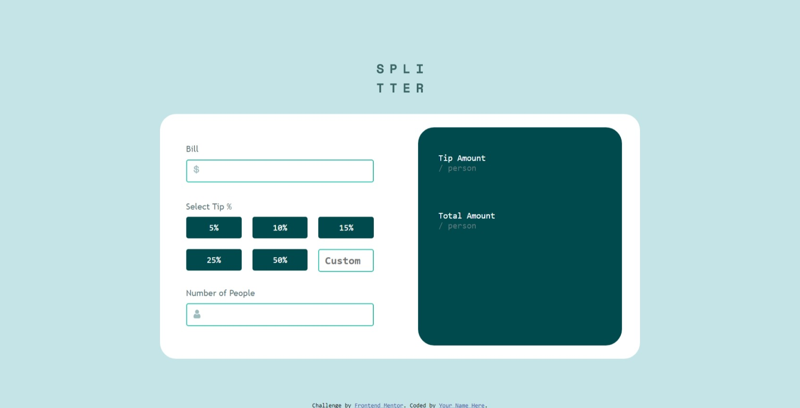

# Frontend Mentor - Tip calculator app solution

This is a solution to the [Tip calculator app challenge on Frontend Mentor](https://www.frontendmentor.io/challenges/tip-calculator-app-ugJNGbJUX). Frontend Mentor challenges help you improve your coding skills by building realistic projects.

## Table of contents

- [Overview](#overview)
  - [The challenge](#the-challenge)
  - [Screenshot](#screenshot)
  - [Links](#links)
- [My process](#my-process)
  - [Built with](#built-with)
  - [What I learned](#what-i-learned)

## Overview

### The challenge

Users should be able to:

- View the optimal layout for the app depending on their device's screen size
- See hover states for all interactive elements on the page
- Calculate the correct tip and total cost of the bill per person

### Screenshot



### Links

- Solution URL: [Add solution URL here](https://your-solution-url.com)
- Live Site URL: [Add live site URL here](https://your-live-site-url.com)

## My process

### Built with

- Semantic HTML5 markup
- CSS custom properties
- Flexbox
- CSS Grid
- Mobile-first workflow

### What I learned

Use this section to recap over some of your major learnings while working through this project. Writing these out and providing code samples of areas you want to highlight is a great way to reinforce your own knowledge.

To see how you can add code snippets, see below:

```html
<div class="form-container">
  <div class="image-container1">
    
  </div>
  <input type="text" id="bill-input" name="bill" />
</div>
```

```css
.button-fifty {
  background-color: $Verydarkcyan;
  border: none;
  color: $White;
  text-align: center;
  text-decoration: none;
  display: inline-block;
  font-size: 16px;
  padding: 5px;
  font-family: "Space Mono", monospace;
  flex: 1 0 100px;
  height: 40px;
  cursor: pointer;
  border-radius: 4px;
}

.button-fifty:hover {
  background-color: $primarycyan;
}

.button-fifty:focus {
  background-color: $primarycyan;
}
```

```js
document.getElementById("custom-input").onchange = function () {
  getValue5();
};

function getValue5() {
  PerformComparison();
  //Final Calculation Value
  let TipAmountFinalValue;
  let TipAmount;
  let CustomValueFinal;
  const Bill1 = parseFloat(Bill);
  const NumberOfPeople1 = parseFloat(NumberOfPeople);
  CustomValue = document.getElementById("custom-input").value;
  // Dividing it by 100 because it is a discount
  if (isNaN(Bill1) && isNaN(NumberOfPeople1)) {
    return;
  } else {
    CustomValue1 = parseFloat(CustomValue);
    CustomValueFinal = CustomValue1 / 100;
    TipAmount = (CustomValueFinal * Bill1) / NumberOfPeople1;
    // Setting the amount of fixed decimal places
    TipAmountFinalValue = TipAmount.toFixed(2);
    // displaying result for tip amount
    if (isNaN(TipAmountFinalValue)) {
      return;
    } else {
      document.getElementById("amount").value = "$" + TipAmountFinalValue;
    }
    let TotalAmount1;
    let TotalAmount2;
    let TotalAmount3;
    let TotalAmount4;
    let TotalAmount5;
    let TotalAmount6;
    let TotalAmountFinal;
    TotalAmount1 = CustomValueFinal * Bill1;
    TotalAmount2 = TotalAmount1.toFixed(2);
    TotalAmount3 = parseFloat(TotalAmount2);
    TotalAmount4 = TotalAmount3 + Bill1;
    TotalAmount5 = parseFloat(TotalAmount4);
    TotalAmount6 = TotalAmount5 / NumberOfPeople1;
    TotalAmountFinal = TotalAmount6.toFixed(2);

    if (isNaN(TotalAmountFinal)) {
      return;
    } else {
      document.getElementById("total").value = "$" + TotalAmountFinal;
    }
  }
}
```

## Author

- Website - [Salihu Andulhamid](https://infallible-pike-a0b433.netlify.app/)
- Frontend Mentor - [@Codedzephyr](https://www.frontendmentor.io/profile/Codedzephyr)
- Twitter - [@dimah](https://www.twitter.com/_Dimah__)
